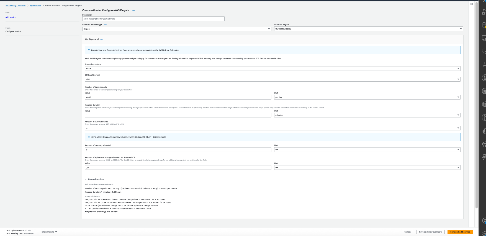
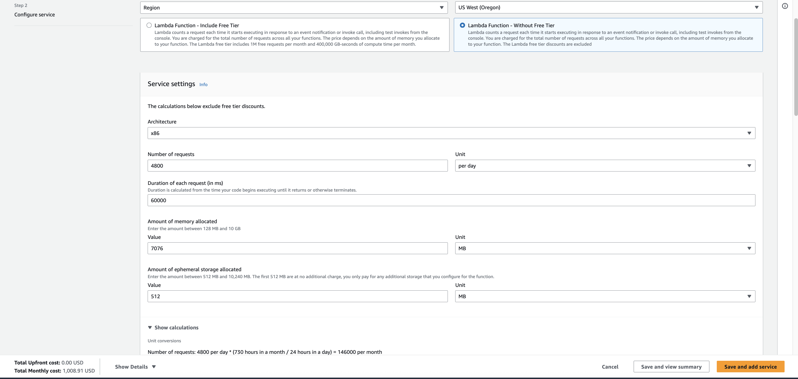
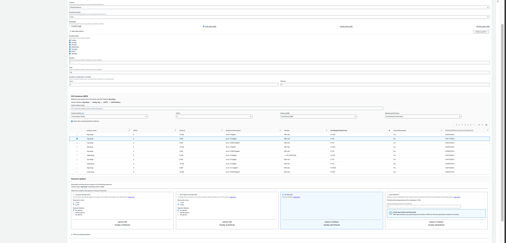

### Introduction

As a student, every time we use AWS services, we are concerned about the cost. While we learned about Fargate and Lambda services, we only briefly discussed cost. In this report, I want to explore three major AWS compute abstractions - Lambda, Fargate, and EC2 - to understand their cost dynamics, operational demands, and suitability for QA and DevOps workflows. This analysis is based on the US West (Oregon) Region.

### Overview Summary (Hypothesis)

| Service | Abstraction Level     | Best Use Cases                                    | Cost Behavior                    |
| ------- | --------------------- | ------------------------------------------------- | -------------------------------- |
| Lambda  | Serverless functions  | Event-driven tasks, unpredictable traffic         | Pay per request + execution time |
| Fargate | Serverless containers | Containerized workloads without server management | Pay per vCPU + memory per second |
| EC2     | Virtual machines      | Full control over environment, steady workloads   | Pay per instance hour            |

Scenario — Large queue: 4800 requests, each request averaging 60s, occurring once per day.

We will compare the cost with equivalent compute power (~4 vCPU) across all services to ensure a fair comparison.

### Cost Calculation Results (US West - Oregon)

Based on the AWS Pricing Calculator, here are the estimated monthly costs for processing the large queue workload (4800 requests/day).

#### 1. AWS Fargate

- **Configuration**: 4 vCPU, 8 GB Memory
- **Usage**: 4800 tasks/day, 1 minute average duration
- **Monthly Cost**: **$576.65**

#### 2. AWS Lambda

- **Configuration**: 7076 MB Memory (Equivalent to ~4 vCPU), x86
- **Usage**: 4800 requests/day, 60,000 ms (60s) duration
- **Monthly Cost**: **$1,008.91**
- _Note: Lambda is significantly more expensive here because to get 4 vCPUs of power, we are forced to provision 7GB of RAM, even if the app doesn't need that much memory._

#### 3. Amazon EC2 (Comparison)

- **Configuration**: c6g.xlarge (4 vCPU, 8 GiB Memory)
- **Usage**: Daily spike pattern (Baseline: 1 instance, Peak: 20 instances for 2 hours to process the batch)
- **Monthly Cost**: **$256.47** (On-Demand)

### Scalability & Runtime Comparison

Beyond cost, the operational behavior of these services differs significantly.

| Feature               | AWS Lambda                                               | AWS Fargate                                                                                                 | Amazon EC2                                                            |
| :-------------------- | :------------------------------------------------------- | :---------------------------------------------------------------------------------------------------------- | :-------------------------------------------------------------------- |
| **Scaling Speed**     | **Instant** (ms to seconds). Handles bursts immediately. | **Moderate** (minutes). Needs to provision new containers.                                                  | **Slow** (minutes). Needs to boot full instances.                     |
| **Scaling Mechanism** | Event-driven (1 request = 1 invoke).                     | Metric-based (e.g., CPU > 70%) or Scheduled.                                                                | Auto Scaling Groups (ASG) based on metrics.                           |
| **Runtime Limit**     | **15 Minutes Max**. Strict timeout.                      | Unlimited.                                                                                                  | Unlimited.                                                            |
| **Cold Starts**       | Yes. Can impact latency for sporadic traffic.            | No (once running). Task startup takes time, but running tasks are persistent.                               | No (once running).                                                    |
| **Idle Cost**         | **$0**. You pay nothing when not running.                | **Pay for uptime**. Even if idle, you pay for the provisioned task. (But it could be set to 0 to save cost) | **Pay for uptime**. You pay for the instance as long as it's running. |

### Conclusion

For a predictable, high-volume daily batch job with significant compute requirements (4 vCPU per request):

- **EC2** offers the lowest cost ($256.47/mo) but requires managing auto-scaling groups and instance lifecycles. However, due to cold starts, it may take longer to spin up and handle the load. For a daily batch job, EC2 is a good choice, but for applications with variable traffic, it may add latency during scale-up.
- **Fargate** provides a middle ground ($576.65/mo), abstracting server management while being cheaper than Lambda for this specific high-resource profile. It offers a balance between cost and operational overhead. AWS handles scaling, and while there is still some startup time for new tasks, it is generally faster than EC2.
- **Lambda** is the most expensive ($1,008.91/mo) in this scenario. This highlights a key Lambda constraint: **Memory and CPU are coupled**. If you need high CPU but low memory, you still have to pay for the memory, making it inefficient for CPU-intensive tasks compared to Fargate or EC2. However, it offers the best scaling speed and zero idle cost, making it ideal for unpredictable, low-volume workloads.

### Final Thoughts

Often, when we select an AWS service that only runs for a limited time with limited requests, we tend to choose Lambda because of its zero idle cost and instant scaling. However, as shown in this report, if the workload is predictable and high volume with significant compute needs, other services like Fargate or EC2 may provide better cost efficiency. It is important to analyze the workload characteristics and choose the right compute abstraction accordingly.

It is worth noting that if the duration of each request is short (e.g., 5000ms), Lambda provides a cost benefit, especially for small APIs with low memory and CPU needs. But for high CPU needs and longer durations (30s or above), Lambda is not cost-effective.

ECS with Fargate is a good middle ground that provides serverless container management without the high cost of Lambda in such scenarios. However, its 1-minute minimum charge could be a drawback for very short tasks. Additionally, AWS charges more for Fargate compared to EC2 because of the serverless abstraction it provides.

EC2 remains the most cost-effective for steady, predictable workloads where you can manage the infrastructure, but it comes with the highest operational overhead, which might be worth it for large-scale applications and cost savings.
